# 👋 Hi, I'm Sujit Chintala

  

*"In the vast cosmos of code, even the most brilliant ideas get pulled into the gravitational field of creativity..."*

## 🌌 About Me

- � I'm interested in **building things** that matter
- 🚀 Passionate about turning ideas into reality through code
- 🌟 Always learning, always growing, like the universe itself
- 🕳️ Just like this black hole pulls in celestial bodies, I'm drawn to challenging problems and innovative solutions

## 🌠 Current Orbit

- 💻 Exploring new technologies and frameworks
- 🛰️ Working on projects that push boundaries
- 🌌 Contributing to the open source galaxy

---

<em>Welcome to my digital universe! Feel free to explore my repositories and don't get too close to the event horizon... 😉</em>

<!---
SujitChintala/SujitChintala is a ✨ special ✨ repository because its `README.md` (this file) appears on your GitHub profile.
You can click the Preview link to take a look at your changes.
--->, I’m @SujitChintala
- 👀 I’m interested in building things.

<!---
SujitChintala/SujitChintala is a ✨ special ✨ repository because its `README.md` (this file) appears on your GitHub profile.
You can click the Preview link to take a look at your changes.
--->
